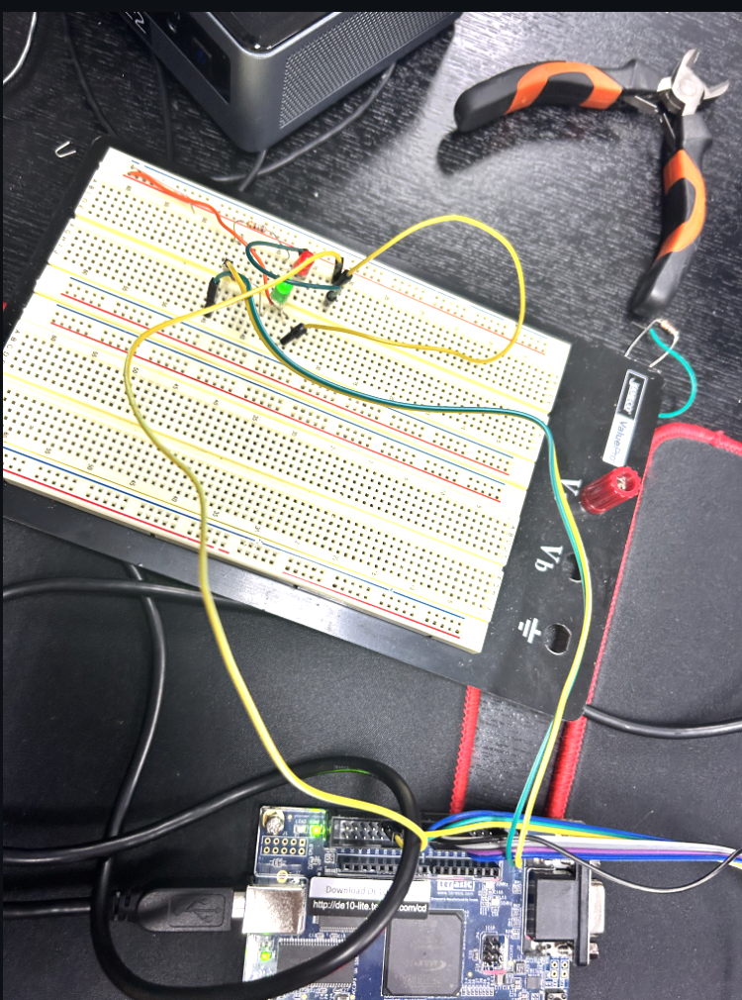
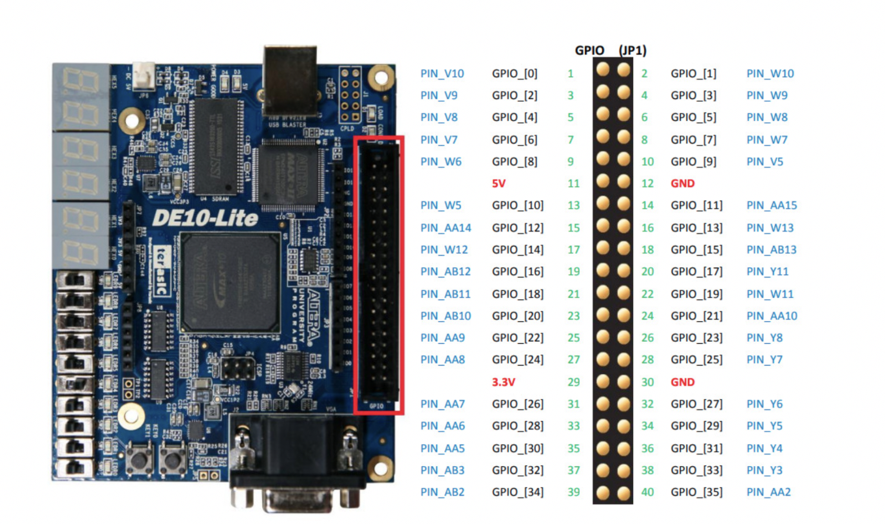
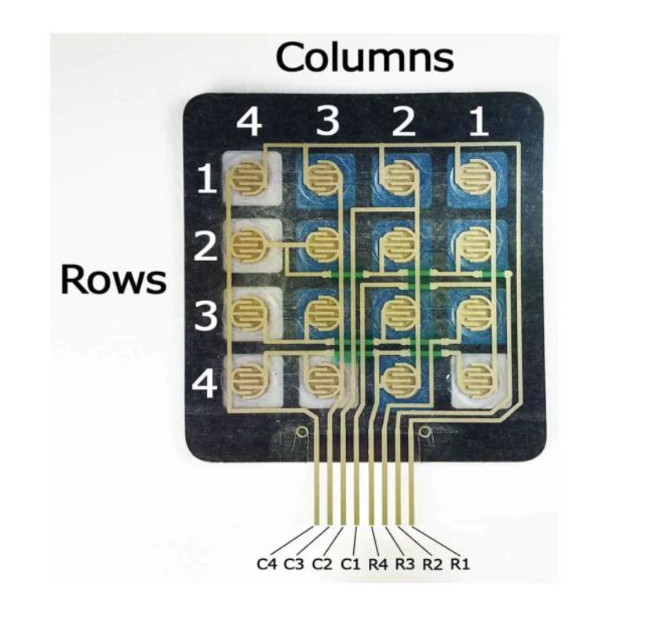
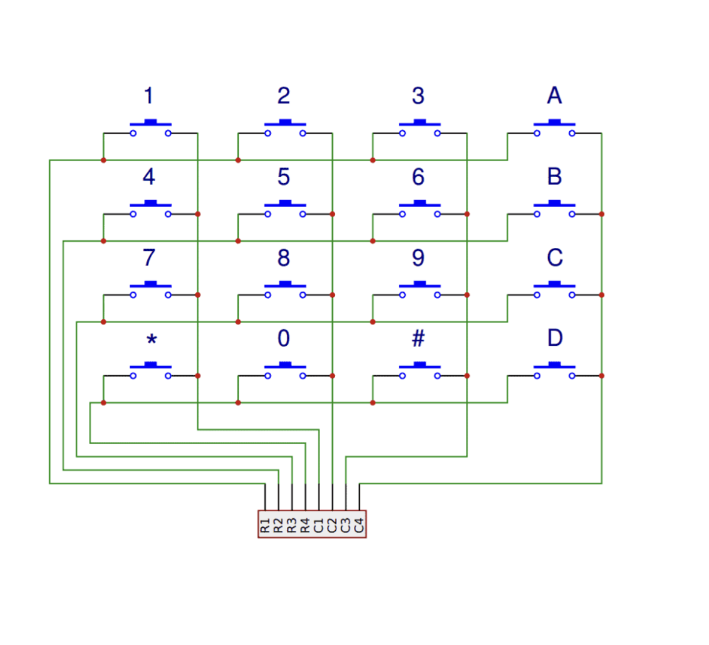
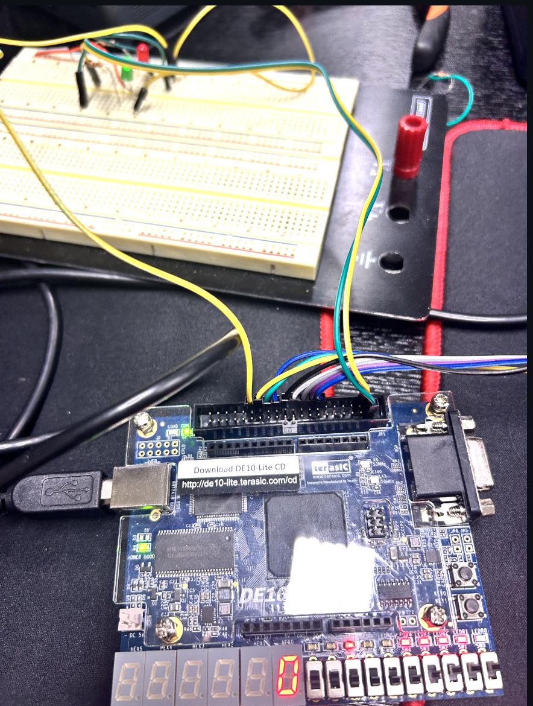

# Digital Keypad Access Lock System  
**Final Project – ECE 3700**

  

 

  

Source: <a href="https://iot-kmutnb.github.io/blogs/teaching/digital_logic_lab_2025-1/intro_fpga_boards/">IoT KMUTNB Blog</a>

## 📌 Purpose  
This project focuses on building a digital keypad-based encrypted lock system.  
Green and red LEDs act as indicators to show whether the user entered the correct password. If the user's inputted password **matches** with the STATIC_PW array in ***Project.v***, PIN_AB3 will be active HIGH, turning on the Green LED. Else, PIN_AA2 will be active HIGH.

Although the original plan was to use an Arduino (since the 4×4 keypad is commonly designed for it), we were able to take input directly from the FPGA. Thanks to Prof. Benoit’s guidance, we used the fact that each key in the keypad contains a simple switch that connects a row and column when pressed.

---

## 🔍 How the Keypad Works  
We used **column-wise scanning**, where:

- **Columns (C1–C4)** → set as *outputs* (Connected with ***PIN_AA15, PIN_W13, PIN_AB13, PIN_Y11***)  
- **Rows (R1–R4)** → set as *inputs* (Connected with ***PIN_W11, PIN_AA10, PIN_Y8, PIN_Y7***)

When a user presses a key, the switch inside closes, connecting one row to one column.  
We detect that connection and convert it to the correct key value inside **Project.v**.

  

  

Source: <a href="https://www.circuitbasics.com/how-to-set-up-a-keypad-on-an-arduino/">How to Set Up a Keypad on an Arduino</a>

---

## ⚙️ System Implementation  
1 second delay was required between successive inputs so the FPGA could correctly process each key press. Once implemented, the system behaved exactly as intended.

### Circuit Setup  

  

---

## 🚀 Future Improvements  
There are several ways this project could be expanded:

- Add more output indicators (e.g., buzzer or display screen)  
- Implement multiple password modes  
- Add lockout timers after incorrect attempts  
- Enhance debouncing and timing models  

This project has been handed over to **Prof. Bhutta** so future students can continue building on it.

---
